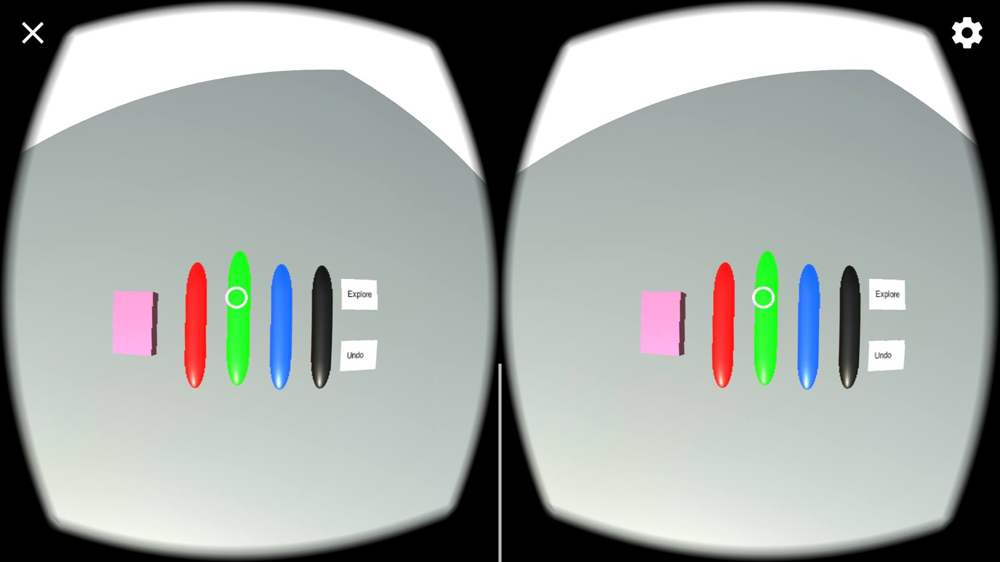
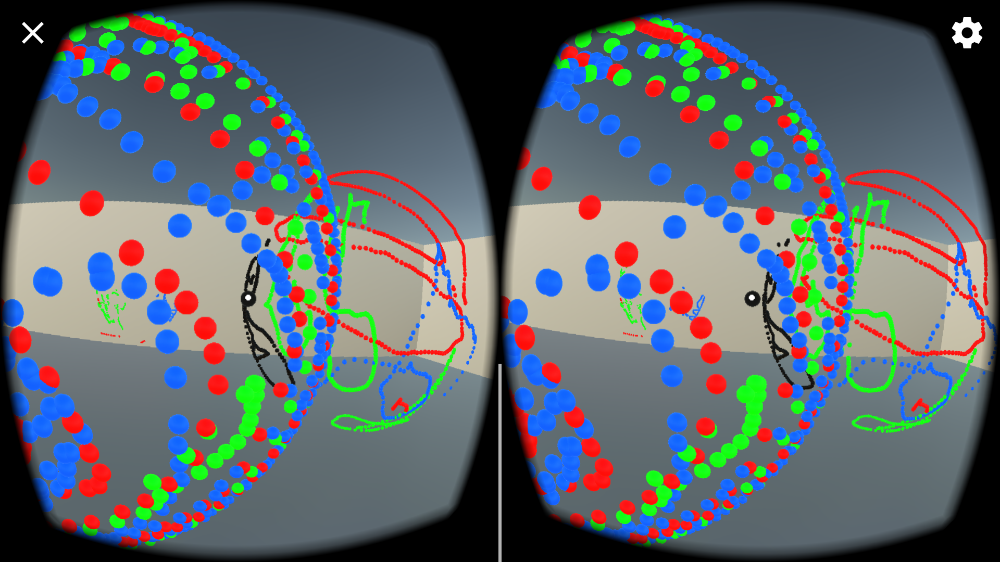
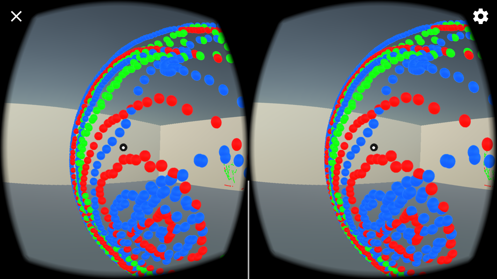

# VVRiteboard
VVRiteboard is a 3D virtual reality paint and design world. It has a simple 360 degrees environment that the user can interact with. VVRiteboard adds an extra kick to drawing as it lets the user create and view their creations in 3D, unlike drawing normally with physical paper and pencil.

## Required Technology
VVRiteboard is run on Android devices and enhanced through the use of Google Cardboard or a device similar to it.

## Full Description
Being a 3D virtual reality world, the user can walk in any direction through orientation of the device. A pointer will show the user the his/her orientation. The menu, with options of pen colors and eraser along with options to undo and explore, can be found at all times by looking down. 

  

When the user selects a tool, the pointer changes colours and he/she stops walking. Once a tool is selected, the user is in design mode, meaning he/she can no longer walk. If he/she is unsatisfied with their drawing, they can choose "Undo" from the menu and hold the drawing they want to get rid of. To exit design mode, the user can select "Explore". The user will exit design mode and be able to walk around again. 

## Gallery
Here are examples of what can be made in VVRiteboard:

  
  
  

## WearHacks 2017
Our devpost submission can be viewed here: https://devpost.com/software/vvriteboard
